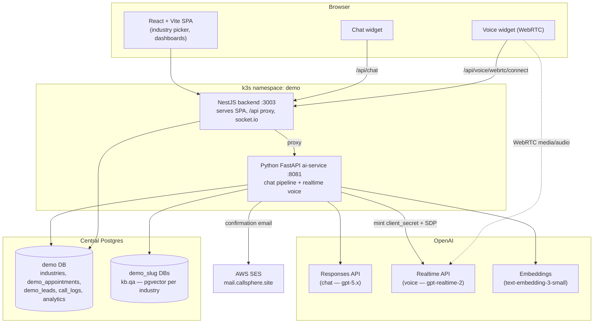
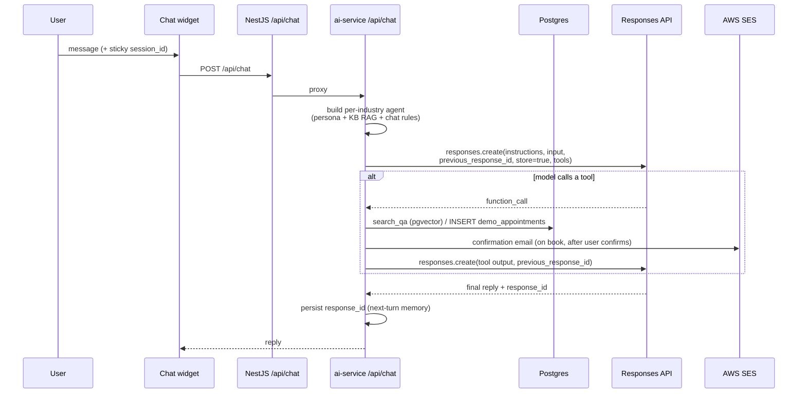
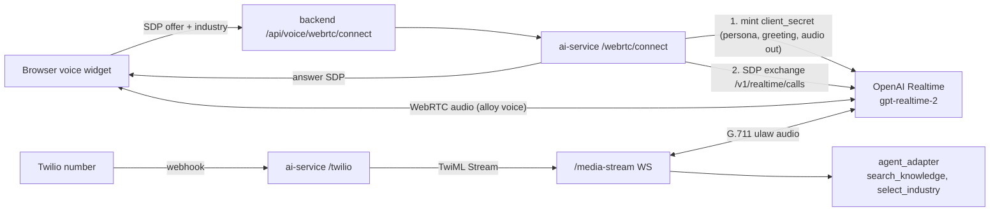
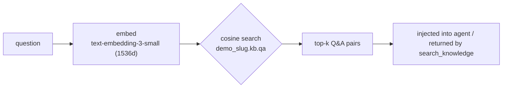

# CallSphere Multi‑Industry Demo

A single codebase that impersonates a **different AI voice + chat receptionist for every industry** CallSphere serves. Pick an industry on the landing page and the whole demo — persona, knowledge base, voice, booking — re‑skins to that business.

- **Live:** https://demo.callsphere.site
- **Industries (13):** Healthcare · Dental · Behavioral Health · Real Estate · Insurance · Finance · Legal · Home Services (HVAC) · Automotive · Hospitality · Logistics · SaaS / IT Support · Body Care (salon, spa & aesthetic/laser clinics)

Each industry has its **own persona**, its **own pgvector knowledge base** (`demo_<slug>` database), and an agent that can **answer from that KB, book a real appointment, and email a confirmation** via AWS SES.

---

## 1. System architecture



The backend serves the built SPA and proxies `/api/chat` + `/api/voice/*` to the ai‑service. All AI logic lives in the ai‑service.

---

## 2. AI services — chat agent (text)

The chat agent is **one dynamic agent** built per request from the selected industry. It uses the **OpenAI Responses API** with built‑in server‑side memory (`previous_response_id`), so it remembers the whole conversation without us replaying history.



**Tools available to the chat agent**

| Tool | What it does |
|------|--------------|
| `search_knowledge` | Vector search over the industry's `demo_<slug>.kb.qa` (per‑industry RAG). |
| `book_appointment` | Validates + writes a real row to `demo_appointments`, then sends an SES confirmation. Only called **after the customer confirms**. |

**Conversation rules (all industries):** short replies, ask the customer's **name + email up front**, list services as a **numbered list**, read details back and **confirm before booking**, then confirm in one line that the email is on its way.

---

## 3. AI services — voice agent (speech‑to‑speech, separate)

Voice is a **separate agent** on the **`gpt-realtime-2`** speech‑to‑speech model with `gpt-realtime-whisper` transcription. It is intentionally kept apart from the chat pipeline.



- **Browser voice** mints an ephemeral `client_secret` with the industry persona + greeting, then the browser talks **directly** to OpenAI Realtime over WebRTC (audio never round‑trips through us).
- **Phone voice** streams Twilio media to OpenAI Realtime via a WebSocket. The shared single line uses a **concierge** persona + `select_industry` tool so one number can demo any industry.

---

## 4. Per‑industry knowledge base (RAG)



Each industry's KB is seeded by `ai-service/scripts/seed_qa.py` (20 brand‑neutral Q&A pairs per industry) into its own `demo_<slug>` database with the `vector` extension and a `kb.qa` table.

---

## 5. Services & layout

| Path | Service | Notes |
|------|---------|-------|
| `frontend/` | React + Vite SPA | Built to `frontend/dist`, served by the backend. |
| `backend/` | NestJS (`:3003`) | Serves SPA, proxies `/api/chat` & `/api/voice/*`, socket.io `/events`, demo/industries/dashboard modules. |
| `ai-service/` | Python FastAPI (`:8081`) | Chat pipeline (`agents/pipeline.py`), industry context + RAG (`industry_context.py`), booking + SES (`booking.py`, `mailer.py`), realtime voice (`sip_integration/`). |
| `k8s/` | Manifests | Deployments, configmap, ingress; secrets via `*-app-secrets` (see `secrets.example.yaml`). |

### Data model (demo DB highlights)
- `industries` — slug, name, tagline, persona, greeting, icon, accent_color.
- `demo_appointments` — real bookings written by the agent (+ `confirmation_sent`).
- `demo_leads` — captured demo emails.
- `call_logs`, `conversation_analysis`, `agent_interactions` — voice/chat analytics.

---

## 6. Local / ops notes

- **Backend** runs straight off the hostPath repo: installs deps + `npm run build` on first start, then `node dist/src/main.js`. Rebuild `dist` to ship backend changes.
- **ai-service** runs `uvicorn main:app` (no `--reload`) — restart the deployment to pick up code changes.
- **Frontend** changes require `npm run build` (served from `frontend/dist`) + a backend restart.
- **Secrets** (DB URL, OpenAI key, Twilio, AWS SES) come from the `demo-app-secrets` Secret — never commit `.env`.

```bash
# seed a fresh industry KB
cd ai-service && ./venv/bin/python -m scripts.seed_qa

# rebuild + ship frontend
cd frontend && npm run build && kubectl rollout restart deploy/demo-backend -n demo

# ship ai-service changes
kubectl rollout restart deploy/demo-ai -n demo
```

---

*Powered by CallSphere — AI voice & chat agents for every industry · [callsphere.ai](https://callsphere.ai)*
